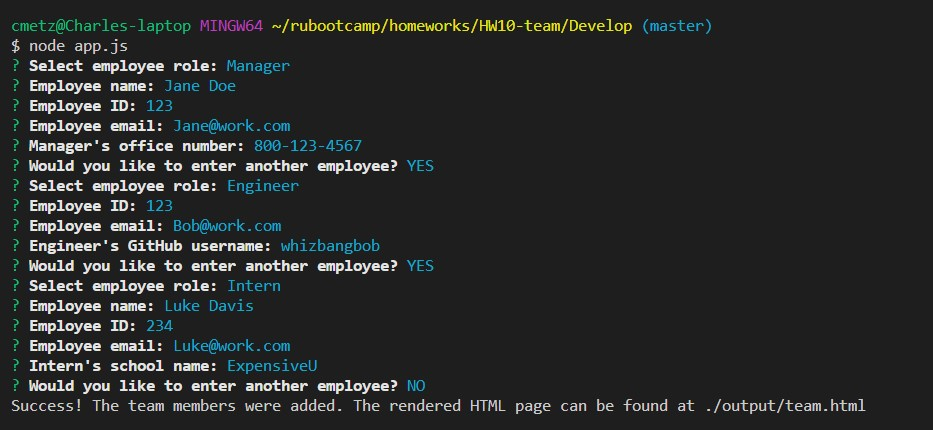
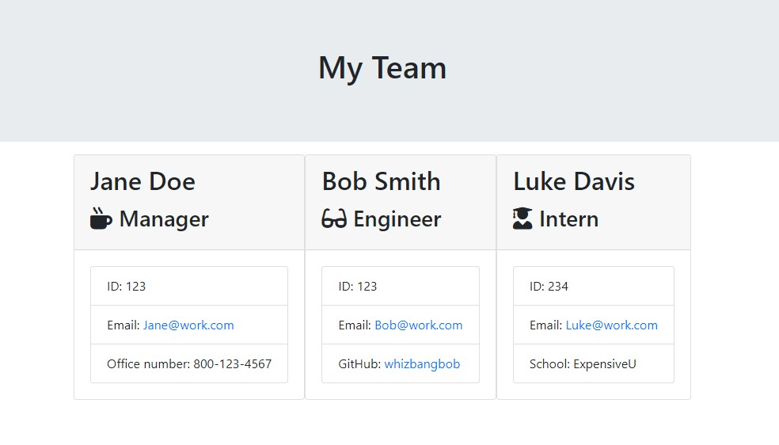
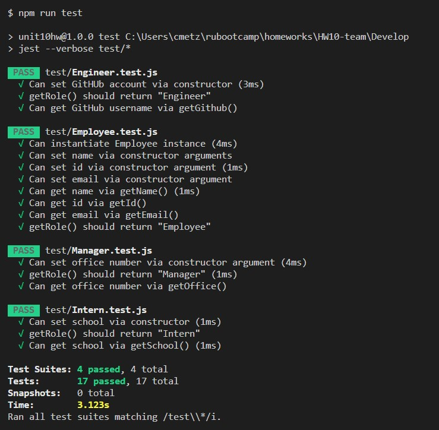

# Team Page Generator

## Description
This is a command-line application that generates a HTML file of team members. It uses Node's *inquirer* module to prompt the user with a series of questions, requesting information about employees in each of 3 roles - manager, engineer, and intern. Unit testing is performed using Node's *Jest* module is used for testing. Once complete, Node's *fs* module will generate `/output/main.html`.

## Table of Contents
* [Installation](#Installation)
* [Application use](#Usage)
* [Contribution Guidelines](#Contribution)
* [Tests](#Tests)
* [License](#License)
* [Questions](#Questions)

## Installation
This is a NodeJS application, so Node must first be installed. Run `npm install` to install the dependencies. In the terminal, type `node app.js` to begin the sequence of prompts.

## Usage
The user will be prompted for the following information:
* For all employees:
    * Employee's role on the team (Manager, Engineer, or Intern)
    * Employee name
    * Employee ID
    * Employee email
* Additional information
    * For Managers - Office phone number
    * For Engineers - GitHub username
    * For Interns - School name  

After all of the prompts are complete, the user will receive a message confirming that the html file was created and reminding the user of its location. At this point, it's ready to be viewed in the browser locally, deployed to your intranet, or uploaded to a webserver.

Screenshot of the completed questions: 

Screenshot of the rendered HTML page: 

[Video demonstration (on Google Drive)](https://drive.google.com/file/d/1q5aIhR47iLMveRm_f0OlssGmyG31W3qg/view):  
https://drive.google.com/file/d/1q5aIhR47iLMveRm_f0OlssGmyG31W3qg/view

## Contribution
Submit bug and feature requests as issues through the GitHub repo.

## Tests
Unit tests conducted using [jest](https://jestjs.io/). Screenshot of the unit test results: 

## License
This app can be used under the terms of the MIT license.

## Questions
For questions, please contact <cmetzjr@yahoo.com>. 
GitHub repo: https://www.github.com/cmetzjr/Team-Generator
